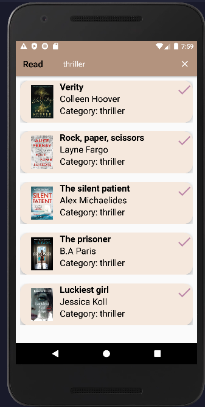

# Project Title

Read, a simple android mobile application.

## Demo

Click on Read to see the Demo...
[Read](https://youtu.be/4_V93xTuIqQ)

## Try it
[Here!](https://www.mediafire.com/file/qp4v9sy5bot1xrn/app-debug.apk/file)

## Description
Read is an Android mobile application that allows users to discover new books based on their interests and preferences.

One of the main features of Read is the ability to browse a wide selection of books in various categories. Users can browse the available categories to find books that match their interests and desires. In addition, they can leave their reviews about the book chosen.

Overall, Read is a useful application for readers who want to discover new books and find something to read that matches their interests and preferences.

## Tools
- Java: The language that implements all the functions.
- Xml: For the layout of the application.
- SQL: It's used to perform various operations on the data.
## Functions
- **MainActivity:**
  This is an activity that handles the user sign up and sign in process.

  The *onCreate* method is called when the activity is first created and sets up the layout for the activity. It also sets up click listeners for the "Register" and "Already have an account" buttons.

  When the user clicks the "Register" button, the code checks the username, password, and confirm password fields are empty and if all fields are filled. It also checks if the password and confirm password fields match.
  If the passwords match, it checks if the username is already taken using the checkusername method from the DBHelper class. If the username is not taken, it tries to insert the new user's data into the database using the insertData method from the DBHelper class. If the insert is successful, it shows a toast message and starts the HomeActivity activity.
  Finally, there's a toast message that appears in all the last coditions mentioned.

  When the user clicks the "Already have an account" button, the code starts the LoginActivity activity.

- **LoginActivity:** This is an activity that handles the user login process.

  The onCreate method is called when the activity is first created and sets up the layout for the activity. It also sets up a click listener for the "Already have an account" button.

  When the user clicks the "Already have an account" button, the code checks if the username and password fields are empty. If both fields are filled, it checks if the username and password combination is correct using the checkusernamepassword method from the DBHelper class. If the combination is correct, it shows a toast message indicating the login was successful and starts the HomeActivity activity. It shows a toas message incorrect if there's an error.
- **DBHelper:**  It’s the DBHelper class, which is a subclass of SQLiteOpenHelper and helps with creating and upgrading the database for the Android app.

  The insertData method inserts a new row into the "Users" table with the given username and password. It returns true if the insert was successful, or false if it was not.

  It implements also three essential methods for checking password and username, and inserting data. "insertData", "checkusername", "checkusernamepassword".

- **HomeActivity:** This is an activity that displays a list of users in a RecyclerView and allows the user to search for a specific user.

  The prepareRecyclerView method sets up the layout for the RecyclerView using a LinearLayoutManager. It also calls the preAdapter method.
  The preAdapter method creates a new UserAdapter object and sets it as the adapter for the RecyclerView.
  The selectedUser method is called when a user in the list is selected and starts the SelectedUserActivity activity, passing the selected user's data as an extra.
  The onOptionsItemSelected method handles the selection of items in the options menu. If the user selects the search item, it returns true.
  The onCreateOptionsMenu method inflates the search menu and sets up a SearchView widget. It also sets up an OnQueryTextListener for the SearchView that filters the list of users based on the search query entered by the user.

- **UserAdapter:** It’s the UserAdapter class, which extends RecyclerView.Adapter and implements the Filterable interface. The UserAdapter is used to display a list of UserModel objects in a RecyclerView.
- **UserModel:** It’s the UserModel class. It is a simple Java class that represents the data for a user in the app. It implements the Serializable interface so that it can be passed as an extra in an Intent when starting a new activity.
  The UserModel class has a constructor that takes values for all of these fields as arguments and sets them as the values of the corresponding fields in the object. Plus, getters and setters for each.
- **SelectedUserActivity:** It’s the SelectedUserActivity class, which represents an activity that displays the details of a selected user.
  When the user click on to see the components of the book, this class allows to show all the informations like title, author ...etc.
- **Experience:** It’s the UserModel class. When the user click on the 'tick icon', it'll show him a new activity which is called Experience, that allows him to send a review about the book, and react with an emoji. If the user don't fill in the text in the review section, a toast message apprears saying please enter a text, otherwhise another toast message appears saying thank you for the review.
- **ExperienceAdapter:** This is an adapter class for a RecyclerView that displays a list of images and corresponding names. The ViewHolder class holds references to the ImageView and TextView that make up each item in the RecyclerView.
- **All xml files:** xml for the layout of the application, they are represented in "Photos" below this section +  "recyclerview_animation" to animate the recyclerview.

## Photos

|                     Register using credentials--> activity_main.xml                      |                  Already have an account (login)--> activity_login.xml                   |
|:----------------------------------------------------------------------------------------:|:----------------------------------------------------------------------------------------:|
|  |  |

|                      Books --> activity_home.xml + row_users.xml                   |                   Search by category --> activity_home.xml + search.xml                    |
| :---------------------------------------------------: |:------------------------------------------------------------------------------------------:|
|  |                          |

|                 Components of books --> activitySelectedUser.xml                  |                      Review --> activity_experience.xml + reactions.xml                       |
|:---------------------------------------------------------------------------------:|:---------------------------------------------------------------------------------------------:|
|     |                 |

## Conclusion
This application was made by heart, special thanks to Harvard university for cs50 course.
